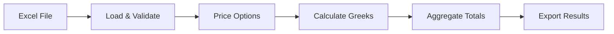

### FX Options Portfolio Risk Aggregator

 This tool will price and aggregrate a portfolio of FX options

## Components

* Models: Greeks and data validation
    - Add Class for FX Option and Result (DONE)
* Pricing : Logic and Calculation of Greeks
    - Pricing Logic (https://www.sciencedirect.com/science/article/abs/pii/S0261560683800011) - (DONE)
    - Calculate Greeks (DONE)
    - Implement notional scaling (DONE)
    - Add logic for put (DONE)
* I/O - File Handling i.e Reading and Writing 
    - Add Reader for reading Excel files
    - Add Writer 
* Orchestration - Full pipeline herein
    - Logging

## Flow

## Pricing Model
This model implements the Garman-Kohlhagen process which builds on the standard Black-Scholes implmentation catering 
for the foreign interest rate as a dividend yield.

## Assumptions
* Constant Volatility.
* Notional Scaling applied to PV and Greeks(DONE).
* Foreign Rate treated as dividend yield.

## Testing 
Test the prcing model, classes and the read writer 
## Setup(WIP):
Dependencies - Can include requirements.txt