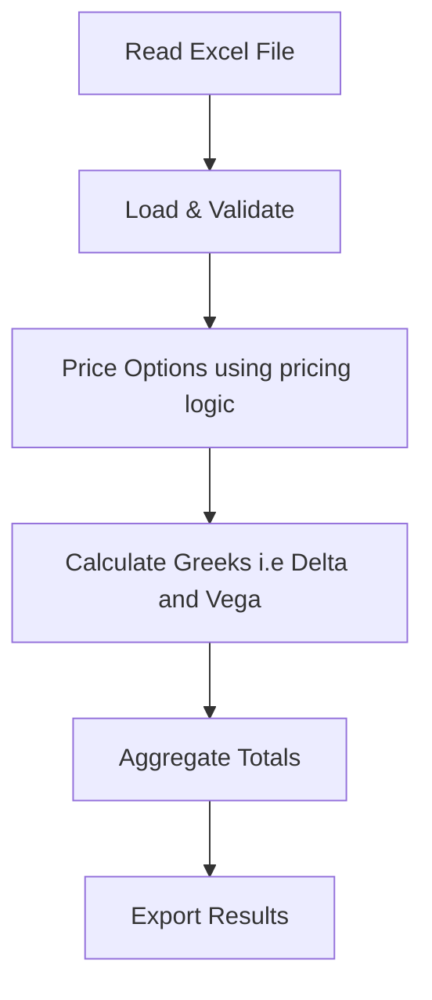

# FX Options Portfolio Risk Aggregator
## Overview

This is a python program that reads a portfolio of FX options from an Excel file, validates the data using Pydantic model,
computes present value (PV), Delta, and Vega for each trade using the Black-Scholes FXOption model, and outputs
results and portfolio summaries to a new Excel file.

# Installation

1. **Clone the repository**:
```bash
git clone [https://github.com/timmyacy/Validus.git](https://github.com/timmyacy/Validus.git)
cd Validus
```

2. **Setup the virtual environment**:
```bash
python3 -m venv venv
source venv/bin/activate 
```
3. **Install dependencies**:
```bash
pip install -r requirements.txt 
```
Dependencies:
- pandas
- openpyxl
- numpy
- scipy
- pydantic.

## Usage

Run the program from the command line, providing the input and output file paths:

```bash
 # python -m src.main path/to/input.xlsx path/to/output.xlsx
python3 -m src.main fx_trades__1_.xlsx output.xlsx
```

## Testing

Run tests:

```bash
python3 -m pytest tests/
```
To run specific test
```bash
pytest tests/test_pricing.py::test_call_positive_delta -v
```

For detailed output

```bash
python3 -m pytest tests/ -v
```

**Test coverage:**
- Delta signs, vega positivity, PV non-negativity.
- Pydantic validation i.e negative values, missing fields.
- Portfolio aggregation logic.

## Features

* **Data Loading**: Loads .xlsx files and maps columns directly to the FXOption model.
* **Validation**: Uses Pydantic model to enforce data types and positive value constraints.
* **Pricing Model**: Implements the Black-Scholes formula using the Garman-Kohlhagen adjustment for FX.
* **Greek Calculations**: Calculates Delta and Vega scaled by notional and adjusted for currency.
* **Edge Cases**: Handles expired trades or trades at maturity by returning intrinsic value and zero vega.
* **Portfolio Aggregation**: Aggregates total PV, Delta, and Vega across the entire trade list.
* **Excel Output**: Generates a file with two distinct sheets: Individual Greeks and Portfolio Summary.
* **Logging and CLI**: Includes a command line interface with a --verbose flag for debugging calculations.

## Output

The tool generates an Excel file with two sheets with sample numbers below:

### Sheet 1: Individual Greeks
| TradeID | PV       | Delta      | Vega    |
|---------|----------|------------|---------|
| T000001 | 15127.07 | 362270.39  | 1891.85 |
| T000002 | 15582.70 | -207883.22 | 1396.25 |
| ...     | ...      | ...        | ...     |

| total_pv | total_delta | total_vega | num of trades |
|----------|-------------|------------|---------------|
| 335002.1 | 15127.07    | 362270.39  | 10            |


### Architecture

The project follows:

- **Models** (`src/models/`) - Pydantic models for data validation
  - `option.py`: FXOption input model with Field validators
  - `result.py`: FXOptionResult and PortfolioSummary output models
  
- **Pricing** (`src/pricing/`) - Black-Scholes calculations
  - `black_scholes.py`: Stateless pricing functions using Garman-Kohlhagen model
  
- **I/O** (`src/io/`) - File operations
  - `reader.py`: Excel reading with column mapping
  - `writer.py`: Multi-sheet Excel writing

- **Orchestration** (`src/main.py`) - Workflow coordination and includes a CLI built with `argparse` that supports a `--verbose` flag for execution tracing.

## Flow

A flowchart of the application is shown below:


## Pricing Model

Implements the standard model for FX options for which the foreign interest rate acts as a continuous dividend yield ([Garman & Kohlhagen (1983)](https://www.sciencedirect.com/science/article/abs/pii/S0261560683800011))

$$d_1 = \frac{\ln(S/K) + (r_d - r_f + 0.5\sigma^2)T}{\sigma\sqrt{T}}$$
$$d_2 = d_1 - \sigma\sqrt{T}$$


* **Delta (Call)**: $\Delta_{call} = e^{-r_f T}N(d_1)$
* **Delta (Put)**: $\Delta_{put} = e^{-r_f T}(N(d_1) - 1)$
* **Vega**: $\nu = S e^{-r_f T} N'(d_1) \sqrt{T} \times 0.01$

> Note: $N(\cdot)$ is the cumulative normal distribution, $N'(\cdot)$ is the standard normal probability density function, and Vega is scaled for a 1% absolute change in volatility.

## Assumptions

**Input Data:**
- Excel file uses these column names: `TradeID`, `Underlying`, `Notional`, `NotionalCurrency`, `Spot`, `Strike`, `Vol`, `RateDomestic`, `RateForeign`, `Expiry`, `OptionType`
- Interest rates and volatility are decimals (e.g., 0.05 for 5%).
- Expiry is in years (e.g., 0.25 for 3 months).
- Options are European-style. 

**Pricing Model:**
- Uses Garman-Kohlhagen extension of Black-Scholes for FX options
- Foreign rate treated as continuous dividend yield
- Constant volatility

**Greeks:**
- Delta and Vega are scaled by notional for portfolio aggregation
- Vega reported per 1% absolute volatility change (market convention)
- Notional conversion: If notional is in quote currency, convert to base currency using spot rate

**Edge Cases:**
- Options with `Expiry <= 0` are treated as expired (intrinsic value only, zero vega)


# Project Structure

```text
├── src/
│   ├── io/
│   │   ├── __init__.py
│   │   ├── reader.py
│   │   └── writer.py
│   ├── models/
│   │   ├── __init__.py
│   │   ├── option.py
│   │   └── result.py
│   ├── pricing/
│   │   ├── __init__.py
│   │   └── black_scholes.py
│   └── main.py
├── tests/
│   ├── __init__.py
│   └── test_pricing.py
├── .gitignore
├── fx_trades__1_.xlsx
├── output.txt
├── README.md
└── requirements.txt
```